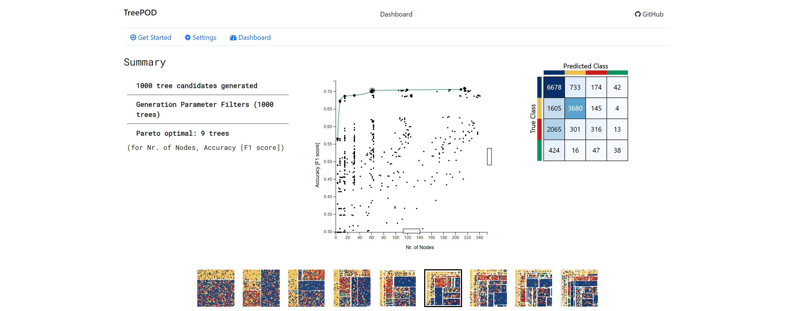

# TreePOD



TreePOD helps you efficiently explore and select decision trees that balance accuracy and interpretability. With intuitive visualizations and sensitivity-aware insights, TreePOD empowers confident, data-driven decisions for experts and beginners alike.

## Team Members

- Yihe Zhuo
- Nianwen Dan
- Nimesh Yadav
- Kaiyuan Tan

## Description

This project is built with Python as the primary programming language for backend development. We uses the [scikit-learn](https://scikit-learn.org/stable/) library for machine learning tasks and have also implemented custom algorithms to support additional operations.

The backend is powered by [Flask](https://flask.palletsprojects.com/en/stable/), a lightweight and efficient web server framework, which handles API operations and serves static front-end files.

To get started, we need to create an virtual environment and install necessary packages.

## Get Started?

To set up the project, follow these steps:

**Download the project use git or directly from the GitHub:**

```
git clone git@github.com:NianwenDan/Decision_Tree_Visualizer.git
```

**Create a virtual environment to isolate dependencies and manage packages efficiently:**

```bash
python -m venv env
```

**Activate the Virtual Environment:**

- On **Windows**:
  ```
  .\env\Scripts\activate
  ```

- On **macOS/Linux**:
  ```
  source env/bin/activate
  ```

**Move to src directory:**

```
cd src
```

**Install Dependencies:**

```
pip install -r requirements.txt
```

**Run the program:**

```
python treepod.py
```

**Now access your browser:** http://127.0.0.1:5500

## Structure

If you wish to contribute or develop this project further, please refer to the following project structure:

```
project_root/
│
├───example                   # Example back-end API output
│   └───api
│       ├───model
│       ├───system
│       └───tree
├───src
│   ├───app                   # Core Flask application/server (back-end)
│   │   ├───dataset
│   │   ├───model
│   │   ├───system
│   │   ├───tree
│   │   └───user
│   ├───datasets              # Pre-loaded dataset
│   └───static                # Core front-end implementation
│       ├───css
│       ├───img
│       └───js
└───docs                      # Documentation purposes ex. readme.md
```

## Licence

This project is licensed under a **Custom License** with the following terms:
  - **You are free to**:
    - Use, copy, modify, and distribute the project for **personal and educational purposes**.
    - Share and adapt the project in non-commercial contexts, provided you give appropriate credit to the original author(s).
  - **Restrictions**:
    - **Commercial Use**: This project or any derivative works **cannot** be used for commercial purposes without explicit written permission from the authors.

For full details, refer to the LICENSE file.
